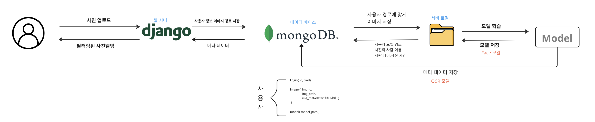
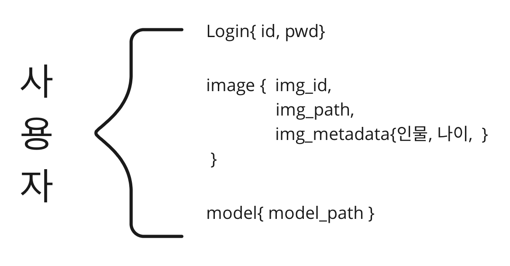
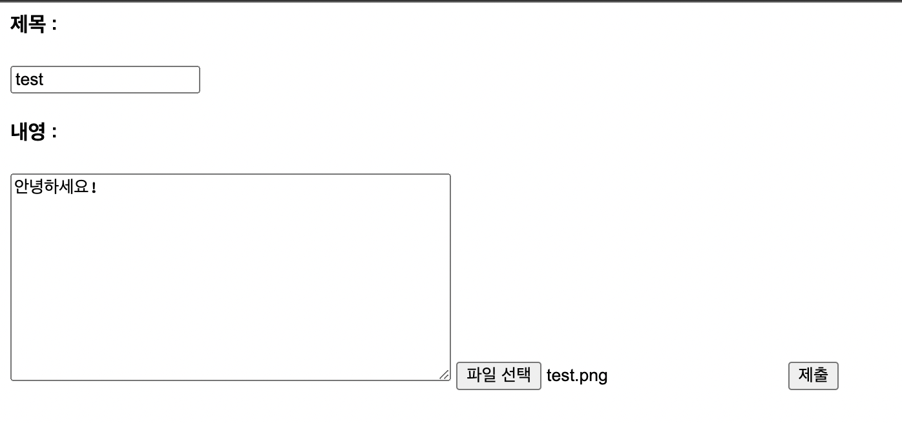
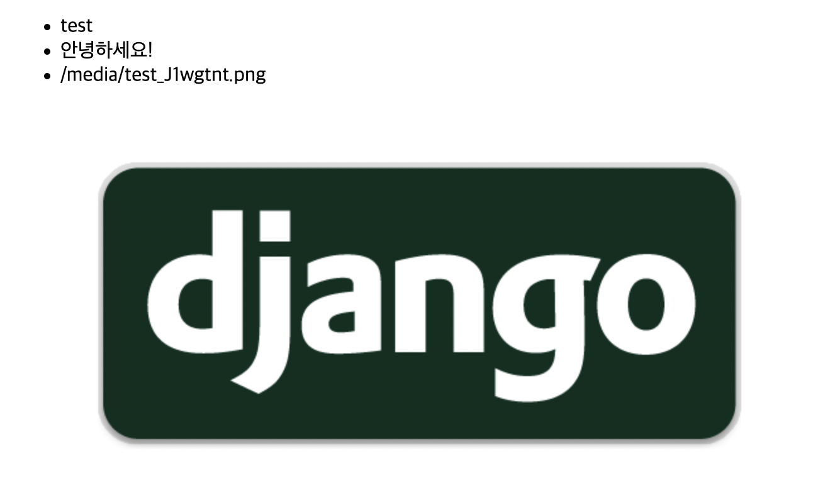

# 데브코스 프로젝트 (백엔드)

- 시간이없어 폐기된 백엔드 ㅠㅠ

## 백엔드 플로 우 차트

---



## 웹서버 : Django

---

- 선택 이유
    - 파이썬 기반 : 파이토치 모델을 서빙하기 위해서 파이썬 기반의 웹프레임워크가 필요
    - 익숙한 프레임워크 : 팀원들의 대다수가 이용한 프레임워크로 학습 시간을 단축 시킬 수 있음몽
    - 몽고디비와 호환성 : 장고는 Django ORM(객체-관계 매핑)을 제공하여, 데이터베이스 작업을 보다 쉽게 처리할 수 있습니다.

### 데이터 베이스 : 몽고 디비

---

- 선택 이유
    - 스키마리스:몽고DB는 스키마리스 데이터베이스이기 때문에, 데이터 모델의 변경에 유연합니다. 스키마리스 데이터베이스는  유연하게 데이터를 구조화할 수 있습니다.
        
        
        
        - 스키마리스 형태로 데이터 구조를 짠 이유가 가장 큰 이유입니다
    - 높은 확장성: 몽고DB는 분산형 데이터베이스 시스템으로, 높은 확장성을 가지고 있습니다. 웹프레임워크인 Django와 호환이 되기 때문에 선택하였습니다
    - 오픈 소스: 몽고DB는 오픈 소스로 제공되기 때문에, 비용을 절감할 수 있으며, 커뮤니티에서 다양한 지원을 받을 수 있습니다.

### 사진 업로드

---

- 프로트 엔드는 다른분이 담당

- 사진 업로드 페이지



### 사진 갤러리

---

- 사진 갤러리 페이지
    - 업로드된 데이터 확인
        - 제목
        - 내용
        - 사진 경로
        - 사진 파일



## 도커 배포
- 아마존 클라우드에 서빙하기위해 도커를 사용
---

- Docker-compose
    - 웹프레임워크 (django 이미지)
        - Dockerfile(Django)
        
        ```docker
        FROM python:3.8
        ENV PYTHONUNBUFFERED=1
        COPY . .
        RUN pip install -r requirements.txt
        ```
        
    - 몽고디비 이미지
    - docker-compose.yml
    
    ```yaml
    services:
      mongodb:
        image: mongo:latest
        restart: always
        environment:
          MONGO_INITDB_ROOT_USERNAME: root
          MONGO_INITDB_ROOT_PASSWORD: mongoadmin
          MONGO_INITDB_DATABASE: django_mongodb_docker
        ports:
          - 27017:27017
    
      web:
        build: .
        restart: always
        command: python manage.py runserver 0.0.0.0:8000
        ports:
          - 8000:8000
        links:
          - mongodb
    ```
